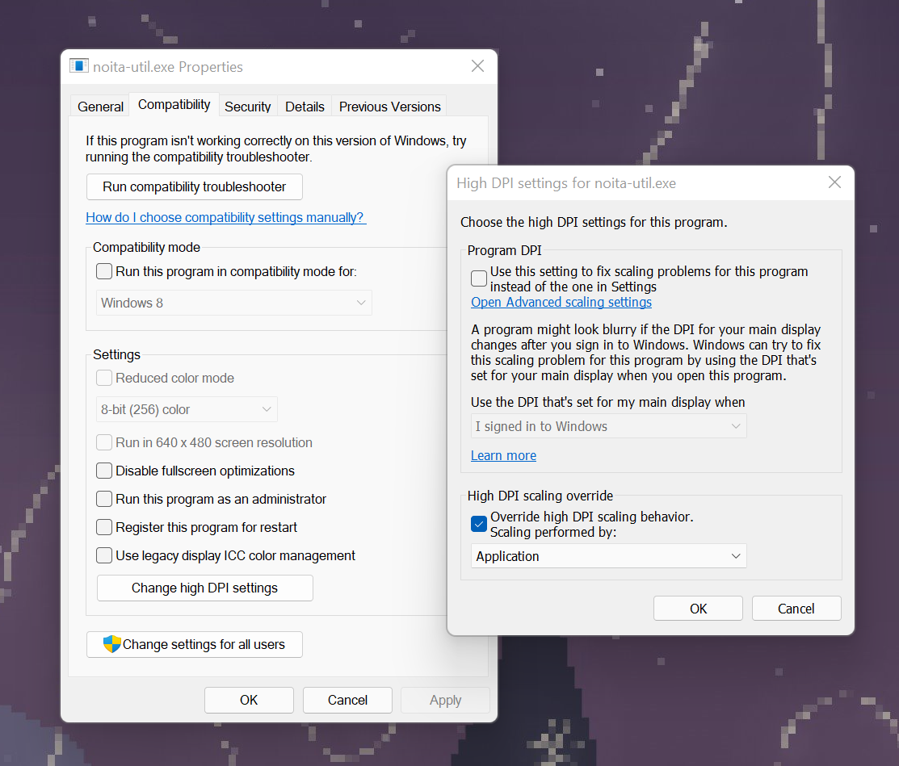

## noita-util

`noita-util` includes the following utilities:

- save file manager (uses zip archives)
- seed runner (no mods involved)
- noita.exe memory usage warning
- quick spell reference with search
- salakieli file decrypter
- bone folder wand browser

To use `noita-util` you must have a `data` folder extracted with the game assets. Follow the instructions in the `tools_modding` folder under the folder containing `noita.exe` to accomplish this.

When you first run `noita-util`, it will try to find:

- the save folder (usually `\\Users\{yourusername}\AppData\LocalLow\Nolla_Games_Noita`)
- the `noita.exe` file (if steam, then usually `\\Program Files (x86)\Steam\steamapps\common\Noita\noita.exe`)

It will also create a backup folder in `\\User\{yourusername}\Desktop\noita_saves`. You can change this in the settings.

If any of these files are not found, you'll get a settings dialog. When the folders have been set up correctly, just run `noita-util` again.

### common issues

If you run `noita-util` on a high DPI display with screen scaling, the app may appear blurry. I'm considering a fix for this in the installer, but if you experience this, use File Explorer to navigate to where you installed `noita-util`, and do the following steps:

- Right-click `noita-util.exe` and select `Properties`.
- Select the `Compatibility` tab
- Click the `Change high DPI settings` button (a new dialog will appear)
- Check the `Override high DPI scaling behavior` checkbox
- From the `Scaling performed by` drop-down, seelect `Application`.
- Click `OK` on both open dialogs.

### screenshots

